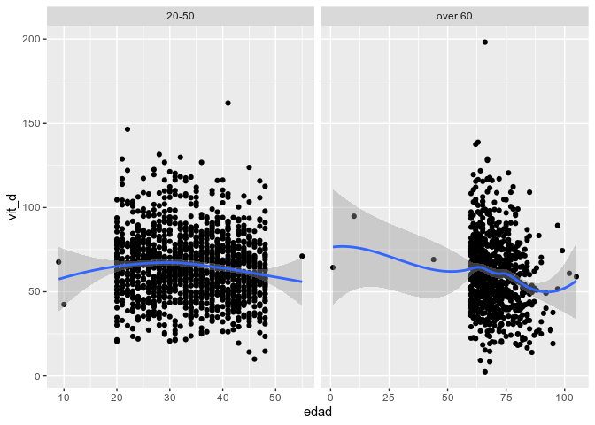
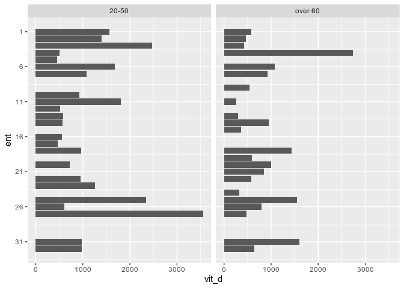
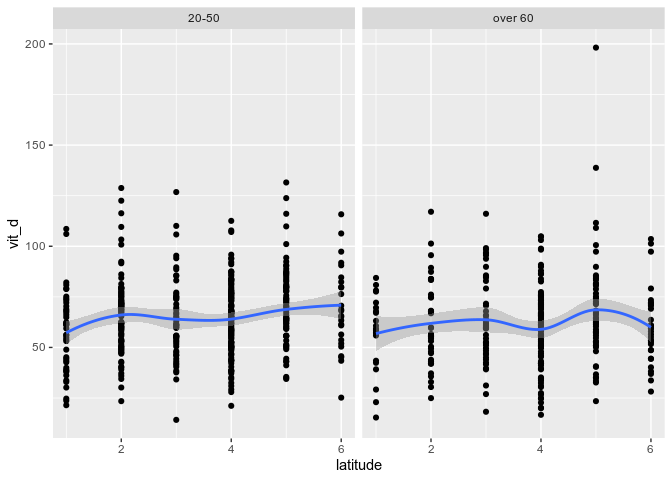
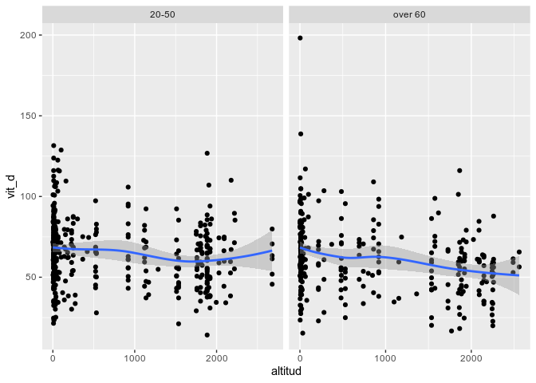
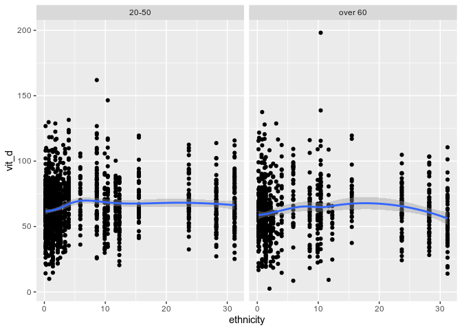

Vitamin D Analysis
================
Carlos Dobler
Last update: February 23 2021 (18:43)

Pre-processesing
================

-   Filter out 1 obs from 20-50 y-o database with impossibly high Vit D values
-   Filter out 8 obs from +60 y-o database with sexo == 1
-   Filter out 1 obs from +60 y-o database with age &lt; 60
-   Filter out municipalities with less than 7 observations from 20-50 y-o database and with less than 5 obs from +60 y-o database

Bivariate plots
===============

### Vit D vs. Edad

### Vit D vs. Entidad

### Vit D vs. Latitude

### Vit D vs. Altitude

### Vit D vs. Ethnicity

Multivariate regression
=======================

Note: data used in this section include both tables (20-50 and over 60)

### Pairwise correlation matrix

First I assessed what explanatory variables may be intercorrelated (to avoid collinearity).

    ##            edad latitude altitud ethnicity
    ## edad      1.000    0.138   0.092     0.163
    ## latitude  0.138    1.000   0.119     0.607
    ## altitud   0.092    0.119   1.000    -0.161
    ## ethnicity 0.163    0.607  -0.161     1.000

As expected, ethnicity and latitude are highly correlated, so I only use one of them in the multivariate regressions.

### Regression (using latitude)

    ## 
    ## Call:
    ## lm(formula = vit_d ~ edad + latitude + altitud, data = db_20_60)
    ## 
    ## Residuals:
    ##     Min      1Q  Median      3Q     Max 
    ## -49.271 -12.856  -0.982  11.151 128.768 
    ## 
    ## Coefficients:
    ##               Estimate Std. Error t value Pr(>|t|)    
    ## (Intercept) 65.7702448  2.6275946  25.031  < 2e-16 ***
    ## edad        -0.0936935  0.0382722  -2.448 0.014604 *  
    ## latitude     1.9684741  0.5273409   3.733 0.000205 ***
    ## altitud     -0.0057123  0.0008675  -6.585  8.9e-11 ***
    ## ---
    ## Signif. codes:  0 '***' 0.001 '**' 0.01 '*' 0.05 '.' 0.1 ' ' 1
    ## 
    ## Residual standard error: 19.68 on 707 degrees of freedom
    ## Multiple R-squared:  0.07659,    Adjusted R-squared:  0.07267 
    ## F-statistic: 19.55 on 3 and 707 DF,  p-value: 3.495e-12

The model shows a significant but very little capacity to predict Vit D levels using age, altitude, and latitude (these variables explain ~0.005% of the variance in Vit D). However, the effect of all variables is significant. When controlling for the rest of the variables, edad and altitud have a negative relation with Vit D levels, while latitude has a positive relation with Vit D levels.
